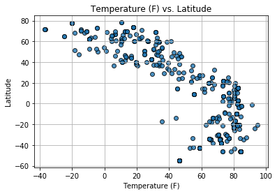
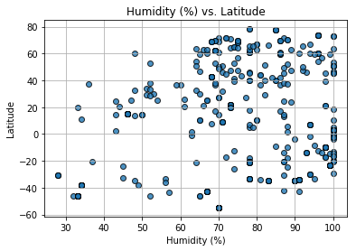
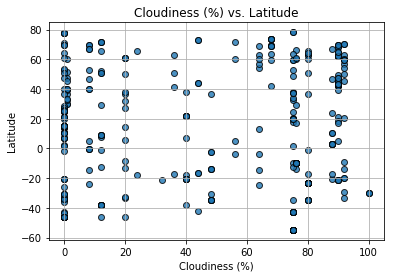
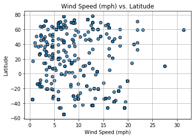

```python
from citipy import citipy
import os
import csv
import matplotlib.pyplot as plt
import requests
import pandas as pd
import random
import json
```


```python
lat=[random.randint(-90,90) for n in range(0,550)]
lon=[random.randint(-180,180) for n in range(0,550)]
coordinates = list(zip(lat, lon))

from collections import Counter
coordinates = set(coordinates)
len(coordinates)
```


    546


```python
cities = []
for coordinate_pair in coordinates:
    lat, lon = coordinate_pair
    cities.append(citipy.nearest_city(lat, lon))
```


```python
name_list = []
for city in cities:
    name = city.city_name
    name_list.append(name)
df = pd.DataFrame({'City Names':name_list, "Latitude": '',
                            "Longitude": '',
                            "Temp (F)": '',
                            "Humidity (%)": '',
                            "Cloudiness (%)": '',
                            "Wind Speed (mph)": ''})
df['City Names'] = df['City Names'].str.replace(' ', '_')
```


```python
api_key = "053aa68d09a7d24f23ab734d2edadb41"
url = "http://api.openweathermap.org/data/2.5/weather?"
units = "imperial"

for index, row in df.iterrows():
    query_url = url + "appid=" + api_key + "&units=" + units + "&q=" + str(row['City Names'])
    weather_json = requests.get(query_url).json()
    try:
        df.set_value(index, "Latitude", weather_json["coord"]["lat"])
        df.set_value(index, "Longitude", weather_json["coord"]["lon"])
        df.set_value(index, "Temp (F)" , weather_json["main"]["temp"])
        df.set_value(index, "Humidity (%)" , weather_json["main"]["humidity"])
        df.set_value(index, "Cloudiness (%)" , weather_json["clouds"]["all"])
        df.set_value(index, "Wind Speed (mph)" , weather_json["wind"]["speed"])
    except:
        print("Missing field... skipping.")
    
    print(query_url)
df.head()
```

    http://api.openweathermap.org/data/2.5/weather?appid=053aa68d09a7d24f23ab734d2edadb41&units=imperial&q=mahebourg
    Missing field... skipping.
    http://api.openweathermap.org/data/2.5/weather?appid=053aa68d09a7d24f23ab734d2edadb41&units=imperial&q=east_london
    http://api.openweathermap.org/data/2.5/weather?appid=053aa68d09a7d24f23ab734d2edadb41&units=imperial&q=yellowknife
    http://api.openweathermap.org/data/2.5/weather?appid=053aa68d09a7d24f23ab734d2edadb41&units=imperial&q=havoysund
    http://api.openweathermap.org/data/2.5/weather?appid=053aa68d09a7d24f23ab734d2edadb41&units=imperial&q=rikitea
    Missing field... skipping.
    http://api.openweathermap.org/data/2.5/weather?appid=053aa68d09a7d24f23ab734d2edadb41&units=imperial&q=plettenberg_bay
    http://api.openweathermap.org/data/2.5/weather?appid=053aa68d09a7d24f23ab734d2edadb41&units=imperial&q=usinsk
    http://api.openweathermap.org/data/2.5/weather?appid=053aa68d09a7d24f23ab734d2edadb41&units=imperial&q=rundu
    http://api.openweathermap.org/data/2.5/weather?appid=053aa68d09a7d24f23ab734d2edadb41&units=imperial&q=severo-kurilsk
    Missing field... skipping.
    http://api.openweathermap.org/data/2.5/weather?appid=053aa68d09a7d24f23ab734d2edadb41&units=imperial&q=illoqqortoormiut
    http://api.openweathermap.org/data/2.5/weather?appid=053aa68d09a7d24f23ab734d2edadb41&units=imperial&q=bredasdorp
    http://api.openweathermap.org/data/2.5/weather?appid=053aa68d09a7d24f23ab734d2edadb41&units=imperial&q=busselton
    http://api.openweathermap.org/data/2.5/weather?appid=053aa68d09a7d24f23ab734d2edadb41&units=imperial&q=hamilton
    http://api.openweathermap.org/data/2.5/weather?appid=053aa68d09a7d24f23ab734d2edadb41&units=imperial&q=winslow
    http://api.openweathermap.org/data/2.5/weather?appid=053aa68d09a7d24f23ab734d2edadb41&units=imperial&q=cayenne
    http://api.openweathermap.org/data/2.5/weather?appid=053aa68d09a7d24f23ab734d2edadb41&units=imperial&q=thessalon
    http://api.openweathermap.org/data/2.5/weather?appid=053aa68d09a7d24f23ab734d2edadb41&units=imperial&q=yamada
    Missing field... skipping.
    http://api.openweathermap.org/data/2.5/weather?appid=053aa68d09a7d24f23ab734d2edadb41&units=imperial&q=port_alfred
    http://api.openweathermap.org/data/2.5/weather?appid=053aa68d09a7d24f23ab734d2edadb41&units=imperial&q=ushuaia
    Missing field... skipping.
    http://api.openweathermap.org/data/2.5/weather?appid=053aa68d09a7d24f23ab734d2edadb41&units=imperial&q=palabuhanratu
    http://api.openweathermap.org/data/2.5/weather?appid=053aa68d09a7d24f23ab734d2edadb41&units=imperial&q=riyadh
    http://api.openweathermap.org/data/2.5/weather?appid=053aa68d09a7d24f23ab734d2edadb41&units=imperial&q=magadan
    Missing field... skipping.
    http://api.openweathermap.org/data/2.5/weather?appid=053aa68d09a7d24f23ab734d2edadb41&units=imperial&q=zapadnaya_dvina
    http://api.openweathermap.org/data/2.5/weather?appid=053aa68d09a7d24f23ab734d2edadb41&units=imperial&q=mnogovershinnyy
    http://api.openweathermap.org/data/2.5/weather?appid=053aa68d09a7d24f23ab734d2edadb41&units=imperial&q=vaini
    http://api.openweathermap.org/data/2.5/weather?appid=053aa68d09a7d24f23ab734d2edadb41&units=imperial&q=nanortalik
    http://api.openweathermap.org/data/2.5/weather?appid=053aa68d09a7d24f23ab734d2edadb41&units=imperial&q=tautira
    http://api.openweathermap.org/data/2.5/weather?appid=053aa68d09a7d24f23ab734d2edadb41&units=imperial&q=barrow
    http://api.openweathermap.org/data/2.5/weather?appid=053aa68d09a7d24f23ab734d2edadb41&units=imperial&q=tapes
    http://api.openweathermap.org/data/2.5/weather?appid=053aa68d09a7d24f23ab734d2edadb41&units=imperial&q=shahrud
    Missing field... skipping.
    http://api.openweathermap.org/data/2.5/weather?appid=053aa68d09a7d24f23ab734d2edadb41&units=imperial&q=barentsburg
    http://api.openweathermap.org/data/2.5/weather?appid=053aa68d09a7d24f23ab734d2edadb41&units=imperial&q=ushuaia
    http://api.openweathermap.org/data/2.5/weather?appid=053aa68d09a7d24f23ab734d2edadb41&units=imperial&q=georgetown
    Missing field... skipping.
    http://api.openweathermap.org/data/2.5/weather?appid=053aa68d09a7d24f23ab734d2edadb41&units=imperial&q=kuala_selangor
    http://api.openweathermap.org/data/2.5/weather?appid=053aa68d09a7d24f23ab734d2edadb41&units=imperial&q=cocorit
    Missing field... skipping.
    http://api.openweathermap.org/data/2.5/weather?appid=053aa68d09a7d24f23ab734d2edadb41&units=imperial&q=mar_del_plata
    http://api.openweathermap.org/data/2.5/weather?appid=053aa68d09a7d24f23ab734d2edadb41&units=imperial&q=hibbing
    http://api.openweathermap.org/data/2.5/weather?appid=053aa68d09a7d24f23ab734d2edadb41&units=imperial&q=nouadhibou
    Missing field... skipping.
    http://api.openweathermap.org/data/2.5/weather?appid=053aa68d09a7d24f23ab734d2edadb41&units=imperial&q=port_elizabeth
    http://api.openweathermap.org/data/2.5/weather?appid=053aa68d09a7d24f23ab734d2edadb41&units=imperial&q=dauphin
    http://api.openweathermap.org/data/2.5/weather?appid=053aa68d09a7d24f23ab734d2edadb41&units=imperial&q=bethel
    http://api.openweathermap.org/data/2.5/weather?appid=053aa68d09a7d24f23ab734d2edadb41&units=imperial&q=ambilobe
    Missing field... skipping.
    http://api.openweathermap.org/data/2.5/weather?appid=053aa68d09a7d24f23ab734d2edadb41&units=imperial&q=santa_ines
    http://api.openweathermap.org/data/2.5/weather?appid=053aa68d09a7d24f23ab734d2edadb41&units=imperial&q=leningradskiy
    http://api.openweathermap.org/data/2.5/weather?appid=053aa68d09a7d24f23ab734d2edadb41&units=imperial&q=albany
    http://api.openweathermap.org/data/2.5/weather?appid=053aa68d09a7d24f23ab734d2edadb41&units=imperial&q=severo-yeniseyskiy
    http://api.openweathermap.org/data/2.5/weather?appid=053aa68d09a7d24f23ab734d2edadb41&units=imperial&q=castro
    Missing field... skipping.
    http://api.openweathermap.org/data/2.5/weather?appid=053aa68d09a7d24f23ab734d2edadb41&units=imperial&q=half_moon_bay
    Missing field... skipping.
    http://api.openweathermap.org/data/2.5/weather?appid=053aa68d09a7d24f23ab734d2edadb41&units=imperial&q=nizhneyansk
    http://api.openweathermap.org/data/2.5/weather?appid=053aa68d09a7d24f23ab734d2edadb41&units=imperial&q=busselton
    http://api.openweathermap.org/data/2.5/weather?appid=053aa68d09a7d24f23ab734d2edadb41&units=imperial&q=bethel
    http://api.openweathermap.org/data/2.5/weather?appid=053aa68d09a7d24f23ab734d2edadb41&units=imperial&q=oromocto
    http://api.openweathermap.org/data/2.5/weather?appid=053aa68d09a7d24f23ab734d2edadb41&units=imperial&q=svetlogorsk
    http://api.openweathermap.org/data/2.5/weather?appid=053aa68d09a7d24f23ab734d2edadb41&units=imperial&q=hermanus
    http://api.openweathermap.org/data/2.5/weather?appid=053aa68d09a7d24f23ab734d2edadb41&units=imperial&q=tamandare
    http://api.openweathermap.org/data/2.5/weather?appid=053aa68d09a7d24f23ab734d2edadb41&units=imperial&q=ushuaia
    http://api.openweathermap.org/data/2.5/weather?appid=053aa68d09a7d24f23ab734d2edadb41&units=imperial&q=yellowknife
    Missing field... skipping.
    http://api.openweathermap.org/data/2.5/weather?appid=053aa68d09a7d24f23ab734d2edadb41&units=imperial&q=tsihombe
    http://api.openweathermap.org/data/2.5/weather?appid=053aa68d09a7d24f23ab734d2edadb41&units=imperial&q=rikitea
    Missing field... skipping.
    http://api.openweathermap.org/data/2.5/weather?appid=053aa68d09a7d24f23ab734d2edadb41&units=imperial&q=pa_sang
    http://api.openweathermap.org/data/2.5/weather?appid=053aa68d09a7d24f23ab734d2edadb41&units=imperial&q=qaanaaq
    http://api.openweathermap.org/data/2.5/weather?appid=053aa68d09a7d24f23ab734d2edadb41&units=imperial&q=petropavlovsk-kamchatskiy
    Missing field... skipping.
    http://api.openweathermap.org/data/2.5/weather?appid=053aa68d09a7d24f23ab734d2edadb41&units=imperial&q=amderma
    Missing field... skipping.
    http://api.openweathermap.org/data/2.5/weather?appid=053aa68d09a7d24f23ab734d2edadb41&units=imperial&q=punta_arenas
    http://api.openweathermap.org/data/2.5/weather?appid=053aa68d09a7d24f23ab734d2edadb41&units=imperial&q=katsuura
    Missing field... skipping.
    http://api.openweathermap.org/data/2.5/weather?appid=053aa68d09a7d24f23ab734d2edadb41&units=imperial&q=richards_bay
    Missing field... skipping.
    http://api.openweathermap.org/data/2.5/weather?appid=053aa68d09a7d24f23ab734d2edadb41&units=imperial&q=boa_vista
    http://api.openweathermap.org/data/2.5/weather?appid=053aa68d09a7d24f23ab734d2edadb41&units=imperial&q=igrim
    Missing field... skipping.
    http://api.openweathermap.org/data/2.5/weather?appid=053aa68d09a7d24f23ab734d2edadb41&units=imperial&q=isla_mujeres
    Missing field... skipping.
    http://api.openweathermap.org/data/2.5/weather?appid=053aa68d09a7d24f23ab734d2edadb41&units=imperial&q=kemijarvi
    http://api.openweathermap.org/data/2.5/weather?appid=053aa68d09a7d24f23ab734d2edadb41&units=imperial&q=kholm
    http://api.openweathermap.org/data/2.5/weather?appid=053aa68d09a7d24f23ab734d2edadb41&units=imperial&q=vaini
    http://api.openweathermap.org/data/2.5/weather?appid=053aa68d09a7d24f23ab734d2edadb41&units=imperial&q=ushuaia
    http://api.openweathermap.org/data/2.5/weather?appid=053aa68d09a7d24f23ab734d2edadb41&units=imperial&q=salinas
    Missing field... skipping.
    http://api.openweathermap.org/data/2.5/weather?appid=053aa68d09a7d24f23ab734d2edadb41&units=imperial&q=illoqqortoormiut
    http://api.openweathermap.org/data/2.5/weather?appid=053aa68d09a7d24f23ab734d2edadb41&units=imperial&q=tuktoyaktuk
    Missing field... skipping.
    http://api.openweathermap.org/data/2.5/weather?appid=053aa68d09a7d24f23ab734d2edadb41&units=imperial&q=tsihombe
    http://api.openweathermap.org/data/2.5/weather?appid=053aa68d09a7d24f23ab734d2edadb41&units=imperial&q=dunedin
    http://api.openweathermap.org/data/2.5/weather?appid=053aa68d09a7d24f23ab734d2edadb41&units=imperial&q=kropotkin
    http://api.openweathermap.org/data/2.5/weather?appid=053aa68d09a7d24f23ab734d2edadb41&units=imperial&q=hermanus
    http://api.openweathermap.org/data/2.5/weather?appid=053aa68d09a7d24f23ab734d2edadb41&units=imperial&q=atuona
    Missing field... skipping.
    http://api.openweathermap.org/data/2.5/weather?appid=053aa68d09a7d24f23ab734d2edadb41&units=imperial&q=punta_arenas
    Missing field... skipping.
    http://api.openweathermap.org/data/2.5/weather?appid=053aa68d09a7d24f23ab734d2edadb41&units=imperial&q=nizhneyansk
    http://api.openweathermap.org/data/2.5/weather?appid=053aa68d09a7d24f23ab734d2edadb41&units=imperial&q=rikitea
    Missing field... skipping.
    http://api.openweathermap.org/data/2.5/weather?appid=053aa68d09a7d24f23ab734d2edadb41&units=imperial&q=san_patricio
    Missing field... skipping.
    http://api.openweathermap.org/data/2.5/weather?appid=053aa68d09a7d24f23ab734d2edadb41&units=imperial&q=punta_arenas
    http://api.openweathermap.org/data/2.5/weather?appid=053aa68d09a7d24f23ab734d2edadb41&units=imperial&q=karratha
    http://api.openweathermap.org/data/2.5/weather?appid=053aa68d09a7d24f23ab734d2edadb41&units=imperial&q=puro
    http://api.openweathermap.org/data/2.5/weather?appid=053aa68d09a7d24f23ab734d2edadb41&units=imperial&q=rikitea
    Missing field... skipping.
    http://api.openweathermap.org/data/2.5/weather?appid=053aa68d09a7d24f23ab734d2edadb41&units=imperial&q=quatre_cocos
    http://api.openweathermap.org/data/2.5/weather?appid=053aa68d09a7d24f23ab734d2edadb41&units=imperial&q=doha
    http://api.openweathermap.org/data/2.5/weather?appid=053aa68d09a7d24f23ab734d2edadb41&units=imperial&q=chimore
    http://api.openweathermap.org/data/2.5/weather?appid=053aa68d09a7d24f23ab734d2edadb41&units=imperial&q=leningradskiy
    http://api.openweathermap.org/data/2.5/weather?appid=053aa68d09a7d24f23ab734d2edadb41&units=imperial&q=lebu
    http://api.openweathermap.org/data/2.5/weather?appid=053aa68d09a7d24f23ab734d2edadb41&units=imperial&q=tiksi
    http://api.openweathermap.org/data/2.5/weather?appid=053aa68d09a7d24f23ab734d2edadb41&units=imperial&q=ushuaia
    Missing field... skipping.
    http://api.openweathermap.org/data/2.5/weather?appid=053aa68d09a7d24f23ab734d2edadb41&units=imperial&q=karkaralinsk
    http://api.openweathermap.org/data/2.5/weather?appid=053aa68d09a7d24f23ab734d2edadb41&units=imperial&q=isangel
    http://api.openweathermap.org/data/2.5/weather?appid=053aa68d09a7d24f23ab734d2edadb41&units=imperial&q=albany
    http://api.openweathermap.org/data/2.5/weather?appid=053aa68d09a7d24f23ab734d2edadb41&units=imperial&q=cidreira
    http://api.openweathermap.org/data/2.5/weather?appid=053aa68d09a7d24f23ab734d2edadb41&units=imperial&q=hermanus
    Missing field... skipping.
    http://api.openweathermap.org/data/2.5/weather?appid=053aa68d09a7d24f23ab734d2edadb41&units=imperial&q=khonuu
    http://api.openweathermap.org/data/2.5/weather?appid=053aa68d09a7d24f23ab734d2edadb41&units=imperial&q=morondava
    http://api.openweathermap.org/data/2.5/weather?appid=053aa68d09a7d24f23ab734d2edadb41&units=imperial&q=moratuwa
    http://api.openweathermap.org/data/2.5/weather?appid=053aa68d09a7d24f23ab734d2edadb41&units=imperial&q=kutum
    http://api.openweathermap.org/data/2.5/weather?appid=053aa68d09a7d24f23ab734d2edadb41&units=imperial&q=niigata
    http://api.openweathermap.org/data/2.5/weather?appid=053aa68d09a7d24f23ab734d2edadb41&units=imperial&q=cherskiy
    http://api.openweathermap.org/data/2.5/weather?appid=053aa68d09a7d24f23ab734d2edadb41&units=imperial&q=mahebourg
    Missing field... skipping.
    http://api.openweathermap.org/data/2.5/weather?appid=053aa68d09a7d24f23ab734d2edadb41&units=imperial&q=marathopolis
    http://api.openweathermap.org/data/2.5/weather?appid=053aa68d09a7d24f23ab734d2edadb41&units=imperial&q=yellowknife
    http://api.openweathermap.org/data/2.5/weather?appid=053aa68d09a7d24f23ab734d2edadb41&units=imperial&q=dikson
    http://api.openweathermap.org/data/2.5/weather?appid=053aa68d09a7d24f23ab734d2edadb41&units=imperial&q=rikitea
    http://api.openweathermap.org/data/2.5/weather?appid=053aa68d09a7d24f23ab734d2edadb41&units=imperial&q=aklavik
    http://api.openweathermap.org/data/2.5/weather?appid=053aa68d09a7d24f23ab734d2edadb41&units=imperial&q=saint-francois
    http://api.openweathermap.org/data/2.5/weather?appid=053aa68d09a7d24f23ab734d2edadb41&units=imperial&q=nome
    Missing field... skipping.
    http://api.openweathermap.org/data/2.5/weather?appid=053aa68d09a7d24f23ab734d2edadb41&units=imperial&q=port_elizabeth
    http://api.openweathermap.org/data/2.5/weather?appid=053aa68d09a7d24f23ab734d2edadb41&units=imperial&q=longyearbyen
    http://api.openweathermap.org/data/2.5/weather?appid=053aa68d09a7d24f23ab734d2edadb41&units=imperial&q=jamestown
    http://api.openweathermap.org/data/2.5/weather?appid=053aa68d09a7d24f23ab734d2edadb41&units=imperial&q=cidreira
    http://api.openweathermap.org/data/2.5/weather?appid=053aa68d09a7d24f23ab734d2edadb41&units=imperial&q=butaritari
    http://api.openweathermap.org/data/2.5/weather?appid=053aa68d09a7d24f23ab734d2edadb41&units=imperial&q=hovd
    Missing field... skipping.
    http://api.openweathermap.org/data/2.5/weather?appid=053aa68d09a7d24f23ab734d2edadb41&units=imperial&q=chake_chake
    http://api.openweathermap.org/data/2.5/weather?appid=053aa68d09a7d24f23ab734d2edadb41&units=imperial&q=qaanaaq
    http://api.openweathermap.org/data/2.5/weather?appid=053aa68d09a7d24f23ab734d2edadb41&units=imperial&q=ust-kan
    Missing field... skipping.
    http://api.openweathermap.org/data/2.5/weather?appid=053aa68d09a7d24f23ab734d2edadb41&units=imperial&q=mys_shmidta
    http://api.openweathermap.org/data/2.5/weather?appid=053aa68d09a7d24f23ab734d2edadb41&units=imperial&q=ziro
    Missing field... skipping.
    http://api.openweathermap.org/data/2.5/weather?appid=053aa68d09a7d24f23ab734d2edadb41&units=imperial&q=the_valley
    http://api.openweathermap.org/data/2.5/weather?appid=053aa68d09a7d24f23ab734d2edadb41&units=imperial&q=hobart
    http://api.openweathermap.org/data/2.5/weather?appid=053aa68d09a7d24f23ab734d2edadb41&units=imperial&q=annau
    http://api.openweathermap.org/data/2.5/weather?appid=053aa68d09a7d24f23ab734d2edadb41&units=imperial&q=georgetown
    http://api.openweathermap.org/data/2.5/weather?appid=053aa68d09a7d24f23ab734d2edadb41&units=imperial&q=brae
    http://api.openweathermap.org/data/2.5/weather?appid=053aa68d09a7d24f23ab734d2edadb41&units=imperial&q=pisco
    Missing field... skipping.
    http://api.openweathermap.org/data/2.5/weather?appid=053aa68d09a7d24f23ab734d2edadb41&units=imperial&q=las_varas
    http://api.openweathermap.org/data/2.5/weather?appid=053aa68d09a7d24f23ab734d2edadb41&units=imperial&q=nederland
    Missing field... skipping.
    http://api.openweathermap.org/data/2.5/weather?appid=053aa68d09a7d24f23ab734d2edadb41&units=imperial&q=bolungarvik
    http://api.openweathermap.org/data/2.5/weather?appid=053aa68d09a7d24f23ab734d2edadb41&units=imperial&q=hobart
    http://api.openweathermap.org/data/2.5/weather?appid=053aa68d09a7d24f23ab734d2edadb41&units=imperial&q=souillac
    Missing field... skipping.
    http://api.openweathermap.org/data/2.5/weather?appid=053aa68d09a7d24f23ab734d2edadb41&units=imperial&q=punta_arenas
    http://api.openweathermap.org/data/2.5/weather?appid=053aa68d09a7d24f23ab734d2edadb41&units=imperial&q=nicoya
    http://api.openweathermap.org/data/2.5/weather?appid=053aa68d09a7d24f23ab734d2edadb41&units=imperial&q=chuy
    http://api.openweathermap.org/data/2.5/weather?appid=053aa68d09a7d24f23ab734d2edadb41&units=imperial&q=avarua
    http://api.openweathermap.org/data/2.5/weather?appid=053aa68d09a7d24f23ab734d2edadb41&units=imperial&q=hope
    http://api.openweathermap.org/data/2.5/weather?appid=053aa68d09a7d24f23ab734d2edadb41&units=imperial&q=isangel
    http://api.openweathermap.org/data/2.5/weather?appid=053aa68d09a7d24f23ab734d2edadb41&units=imperial&q=longyearbyen
    http://api.openweathermap.org/data/2.5/weather?appid=053aa68d09a7d24f23ab734d2edadb41&units=imperial&q=baruun-urt
    http://api.openweathermap.org/data/2.5/weather?appid=053aa68d09a7d24f23ab734d2edadb41&units=imperial&q=ixtapa
    http://api.openweathermap.org/data/2.5/weather?appid=053aa68d09a7d24f23ab734d2edadb41&units=imperial&q=takoradi
    http://api.openweathermap.org/data/2.5/weather?appid=053aa68d09a7d24f23ab734d2edadb41&units=imperial&q=ushuaia
    Missing field... skipping.
    http://api.openweathermap.org/data/2.5/weather?appid=053aa68d09a7d24f23ab734d2edadb41&units=imperial&q=palabuhanratu
    http://api.openweathermap.org/data/2.5/weather?appid=053aa68d09a7d24f23ab734d2edadb41&units=imperial&q=tessalit
    http://api.openweathermap.org/data/2.5/weather?appid=053aa68d09a7d24f23ab734d2edadb41&units=imperial&q=liverpool
    http://api.openweathermap.org/data/2.5/weather?appid=053aa68d09a7d24f23ab734d2edadb41&units=imperial&q=avarua
    Missing field... skipping.
    http://api.openweathermap.org/data/2.5/weather?appid=053aa68d09a7d24f23ab734d2edadb41&units=imperial&q=mar_del_plata
    http://api.openweathermap.org/data/2.5/weather?appid=053aa68d09a7d24f23ab734d2edadb41&units=imperial&q=tuktoyaktuk
    Missing field... skipping.
    http://api.openweathermap.org/data/2.5/weather?appid=053aa68d09a7d24f23ab734d2edadb41&units=imperial&q=san_quintin
    Missing field... skipping.
    http://api.openweathermap.org/data/2.5/weather?appid=053aa68d09a7d24f23ab734d2edadb41&units=imperial&q=sataua
    Missing field... skipping.
    http://api.openweathermap.org/data/2.5/weather?appid=053aa68d09a7d24f23ab734d2edadb41&units=imperial&q=barentsburg
    http://api.openweathermap.org/data/2.5/weather?appid=053aa68d09a7d24f23ab734d2edadb41&units=imperial&q=rikitea
    http://api.openweathermap.org/data/2.5/weather?appid=053aa68d09a7d24f23ab734d2edadb41&units=imperial&q=guanica
    http://api.openweathermap.org/data/2.5/weather?appid=053aa68d09a7d24f23ab734d2edadb41&units=imperial&q=mataura
    http://api.openweathermap.org/data/2.5/weather?appid=053aa68d09a7d24f23ab734d2edadb41&units=imperial&q=nouadhibou
    Missing field... skipping.
    http://api.openweathermap.org/data/2.5/weather?appid=053aa68d09a7d24f23ab734d2edadb41&units=imperial&q=kuche
    http://api.openweathermap.org/data/2.5/weather?appid=053aa68d09a7d24f23ab734d2edadb41&units=imperial&q=qaanaaq
    http://api.openweathermap.org/data/2.5/weather?appid=053aa68d09a7d24f23ab734d2edadb41&units=imperial&q=vilhena
    http://api.openweathermap.org/data/2.5/weather?appid=053aa68d09a7d24f23ab734d2edadb41&units=imperial&q=fortuna
    http://api.openweathermap.org/data/2.5/weather?appid=053aa68d09a7d24f23ab734d2edadb41&units=imperial&q=lebu
    http://api.openweathermap.org/data/2.5/weather?appid=053aa68d09a7d24f23ab734d2edadb41&units=imperial&q=manokwari
    http://api.openweathermap.org/data/2.5/weather?appid=053aa68d09a7d24f23ab734d2edadb41&units=imperial&q=ilulissat
    http://api.openweathermap.org/data/2.5/weather?appid=053aa68d09a7d24f23ab734d2edadb41&units=imperial&q=rikitea
    http://api.openweathermap.org/data/2.5/weather?appid=053aa68d09a7d24f23ab734d2edadb41&units=imperial&q=bethel
    http://api.openweathermap.org/data/2.5/weather?appid=053aa68d09a7d24f23ab734d2edadb41&units=imperial&q=kailua
    http://api.openweathermap.org/data/2.5/weather?appid=053aa68d09a7d24f23ab734d2edadb41&units=imperial&q=kaitangata
    http://api.openweathermap.org/data/2.5/weather?appid=053aa68d09a7d24f23ab734d2edadb41&units=imperial&q=kamoke
    http://api.openweathermap.org/data/2.5/weather?appid=053aa68d09a7d24f23ab734d2edadb41&units=imperial&q=kadiri
    http://api.openweathermap.org/data/2.5/weather?appid=053aa68d09a7d24f23ab734d2edadb41&units=imperial&q=atuona
    http://api.openweathermap.org/data/2.5/weather?appid=053aa68d09a7d24f23ab734d2edadb41&units=imperial&q=albany
    http://api.openweathermap.org/data/2.5/weather?appid=053aa68d09a7d24f23ab734d2edadb41&units=imperial&q=kapaa
    http://api.openweathermap.org/data/2.5/weather?appid=053aa68d09a7d24f23ab734d2edadb41&units=imperial&q=nanortalik
    http://api.openweathermap.org/data/2.5/weather?appid=053aa68d09a7d24f23ab734d2edadb41&units=imperial&q=mataura
    Missing field... skipping.
    http://api.openweathermap.org/data/2.5/weather?appid=053aa68d09a7d24f23ab734d2edadb41&units=imperial&q=cheuskiny
    http://api.openweathermap.org/data/2.5/weather?appid=053aa68d09a7d24f23ab734d2edadb41&units=imperial&q=montrose
    http://api.openweathermap.org/data/2.5/weather?appid=053aa68d09a7d24f23ab734d2edadb41&units=imperial&q=butaritari
    http://api.openweathermap.org/data/2.5/weather?appid=053aa68d09a7d24f23ab734d2edadb41&units=imperial&q=hobart
    Missing field... skipping.
    http://api.openweathermap.org/data/2.5/weather?appid=053aa68d09a7d24f23ab734d2edadb41&units=imperial&q=asau
    Missing field... skipping.
    http://api.openweathermap.org/data/2.5/weather?appid=053aa68d09a7d24f23ab734d2edadb41&units=imperial&q=amderma
    Missing field... skipping.
    http://api.openweathermap.org/data/2.5/weather?appid=053aa68d09a7d24f23ab734d2edadb41&units=imperial&q=puerto_ayora
    http://api.openweathermap.org/data/2.5/weather?appid=053aa68d09a7d24f23ab734d2edadb41&units=imperial&q=barrow
    http://api.openweathermap.org/data/2.5/weather?appid=053aa68d09a7d24f23ab734d2edadb41&units=imperial&q=pevek
    http://api.openweathermap.org/data/2.5/weather?appid=053aa68d09a7d24f23ab734d2edadb41&units=imperial&q=barrow
    Missing field... skipping.
    http://api.openweathermap.org/data/2.5/weather?appid=053aa68d09a7d24f23ab734d2edadb41&units=imperial&q=mys_shmidta
    http://api.openweathermap.org/data/2.5/weather?appid=053aa68d09a7d24f23ab734d2edadb41&units=imperial&q=yining
    Missing field... skipping.
    http://api.openweathermap.org/data/2.5/weather?appid=053aa68d09a7d24f23ab734d2edadb41&units=imperial&q=puerto_ayora
    http://api.openweathermap.org/data/2.5/weather?appid=053aa68d09a7d24f23ab734d2edadb41&units=imperial&q=esperance
    http://api.openweathermap.org/data/2.5/weather?appid=053aa68d09a7d24f23ab734d2edadb41&units=imperial&q=dikson
    Missing field... skipping.
    http://api.openweathermap.org/data/2.5/weather?appid=053aa68d09a7d24f23ab734d2edadb41&units=imperial&q=tsihombe
    Missing field... skipping.
    http://api.openweathermap.org/data/2.5/weather?appid=053aa68d09a7d24f23ab734d2edadb41&units=imperial&q=warqla
    Missing field... skipping.
    http://api.openweathermap.org/data/2.5/weather?appid=053aa68d09a7d24f23ab734d2edadb41&units=imperial&q=grand_river_south_east
    Missing field... skipping.
    http://api.openweathermap.org/data/2.5/weather?appid=053aa68d09a7d24f23ab734d2edadb41&units=imperial&q=san_felipe
    http://api.openweathermap.org/data/2.5/weather?appid=053aa68d09a7d24f23ab734d2edadb41&units=imperial&q=fairbanks
    http://api.openweathermap.org/data/2.5/weather?appid=053aa68d09a7d24f23ab734d2edadb41&units=imperial&q=chuy
    Missing field... skipping.
    http://api.openweathermap.org/data/2.5/weather?appid=053aa68d09a7d24f23ab734d2edadb41&units=imperial&q=portpatrick
    http://api.openweathermap.org/data/2.5/weather?appid=053aa68d09a7d24f23ab734d2edadb41&units=imperial&q=seymchan
    http://api.openweathermap.org/data/2.5/weather?appid=053aa68d09a7d24f23ab734d2edadb41&units=imperial&q=hermanus
    http://api.openweathermap.org/data/2.5/weather?appid=053aa68d09a7d24f23ab734d2edadb41&units=imperial&q=upernavik
    http://api.openweathermap.org/data/2.5/weather?appid=053aa68d09a7d24f23ab734d2edadb41&units=imperial&q=mataura
    http://api.openweathermap.org/data/2.5/weather?appid=053aa68d09a7d24f23ab734d2edadb41&units=imperial&q=hobart
    http://api.openweathermap.org/data/2.5/weather?appid=053aa68d09a7d24f23ab734d2edadb41&units=imperial&q=xining
    http://api.openweathermap.org/data/2.5/weather?appid=053aa68d09a7d24f23ab734d2edadb41&units=imperial&q=gamba
    Missing field... skipping.
    http://api.openweathermap.org/data/2.5/weather?appid=053aa68d09a7d24f23ab734d2edadb41&units=imperial&q=lolua
    Missing field... skipping.
    http://api.openweathermap.org/data/2.5/weather?appid=053aa68d09a7d24f23ab734d2edadb41&units=imperial&q=cabo_san_lucas
    Missing field... skipping.
    http://api.openweathermap.org/data/2.5/weather?appid=053aa68d09a7d24f23ab734d2edadb41&units=imperial&q=mys_shmidta
    Missing field... skipping.
    http://api.openweathermap.org/data/2.5/weather?appid=053aa68d09a7d24f23ab734d2edadb41&units=imperial&q=santa_rosa
    http://api.openweathermap.org/data/2.5/weather?appid=053aa68d09a7d24f23ab734d2edadb41&units=imperial&q=georgetown
    Missing field... skipping.
    http://api.openweathermap.org/data/2.5/weather?appid=053aa68d09a7d24f23ab734d2edadb41&units=imperial&q=samusu
    http://api.openweathermap.org/data/2.5/weather?appid=053aa68d09a7d24f23ab734d2edadb41&units=imperial&q=nanortalik
    Missing field... skipping.
    http://api.openweathermap.org/data/2.5/weather?appid=053aa68d09a7d24f23ab734d2edadb41&units=imperial&q=saint_george
    Missing field... skipping.
    http://api.openweathermap.org/data/2.5/weather?appid=053aa68d09a7d24f23ab734d2edadb41&units=imperial&q=mar_del_plata
    Missing field... skipping.
    http://api.openweathermap.org/data/2.5/weather?appid=053aa68d09a7d24f23ab734d2edadb41&units=imperial&q=illoqqortoormiut
    http://api.openweathermap.org/data/2.5/weather?appid=053aa68d09a7d24f23ab734d2edadb41&units=imperial&q=arman
    http://api.openweathermap.org/data/2.5/weather?appid=053aa68d09a7d24f23ab734d2edadb41&units=imperial&q=avarua
    http://api.openweathermap.org/data/2.5/weather?appid=053aa68d09a7d24f23ab734d2edadb41&units=imperial&q=severo-kurilsk
    http://api.openweathermap.org/data/2.5/weather?appid=053aa68d09a7d24f23ab734d2edadb41&units=imperial&q=kiama
    http://api.openweathermap.org/data/2.5/weather?appid=053aa68d09a7d24f23ab734d2edadb41&units=imperial&q=busselton
    http://api.openweathermap.org/data/2.5/weather?appid=053aa68d09a7d24f23ab734d2edadb41&units=imperial&q=yellowknife
    http://api.openweathermap.org/data/2.5/weather?appid=053aa68d09a7d24f23ab734d2edadb41&units=imperial&q=mahebourg
    http://api.openweathermap.org/data/2.5/weather?appid=053aa68d09a7d24f23ab734d2edadb41&units=imperial&q=ushuaia
    Missing field... skipping.
    http://api.openweathermap.org/data/2.5/weather?appid=053aa68d09a7d24f23ab734d2edadb41&units=imperial&q=punta_arenas
    Missing field... skipping.
    http://api.openweathermap.org/data/2.5/weather?appid=053aa68d09a7d24f23ab734d2edadb41&units=imperial&q=punta_arenas
    http://api.openweathermap.org/data/2.5/weather?appid=053aa68d09a7d24f23ab734d2edadb41&units=imperial&q=anloga
    Missing field... skipping.
    http://api.openweathermap.org/data/2.5/weather?appid=053aa68d09a7d24f23ab734d2edadb41&units=imperial&q=port_alfred
    http://api.openweathermap.org/data/2.5/weather?appid=053aa68d09a7d24f23ab734d2edadb41&units=imperial&q=mataura
    Missing field... skipping.
    http://api.openweathermap.org/data/2.5/weather?appid=053aa68d09a7d24f23ab734d2edadb41&units=imperial&q=abu_samrah
    http://api.openweathermap.org/data/2.5/weather?appid=053aa68d09a7d24f23ab734d2edadb41&units=imperial&q=butaritari
    http://api.openweathermap.org/data/2.5/weather?appid=053aa68d09a7d24f23ab734d2edadb41&units=imperial&q=yar-sale
    http://api.openweathermap.org/data/2.5/weather?appid=053aa68d09a7d24f23ab734d2edadb41&units=imperial&q=marawi
    http://api.openweathermap.org/data/2.5/weather?appid=053aa68d09a7d24f23ab734d2edadb41&units=imperial&q=bagotville
    Missing field... skipping.
    http://api.openweathermap.org/data/2.5/weather?appid=053aa68d09a7d24f23ab734d2edadb41&units=imperial&q=mount_gambier
    http://api.openweathermap.org/data/2.5/weather?appid=053aa68d09a7d24f23ab734d2edadb41&units=imperial&q=upernavik
    http://api.openweathermap.org/data/2.5/weather?appid=053aa68d09a7d24f23ab734d2edadb41&units=imperial&q=tuatapere
    http://api.openweathermap.org/data/2.5/weather?appid=053aa68d09a7d24f23ab734d2edadb41&units=imperial&q=northam
    http://api.openweathermap.org/data/2.5/weather?appid=053aa68d09a7d24f23ab734d2edadb41&units=imperial&q=butaritari
    http://api.openweathermap.org/data/2.5/weather?appid=053aa68d09a7d24f23ab734d2edadb41&units=imperial&q=rikitea
    http://api.openweathermap.org/data/2.5/weather?appid=053aa68d09a7d24f23ab734d2edadb41&units=imperial&q=hilo
    Missing field... skipping.
    http://api.openweathermap.org/data/2.5/weather?appid=053aa68d09a7d24f23ab734d2edadb41&units=imperial&q=taolanaro
    http://api.openweathermap.org/data/2.5/weather?appid=053aa68d09a7d24f23ab734d2edadb41&units=imperial&q=frontera
    http://api.openweathermap.org/data/2.5/weather?appid=053aa68d09a7d24f23ab734d2edadb41&units=imperial&q=ushuaia
    Missing field... skipping.
    http://api.openweathermap.org/data/2.5/weather?appid=053aa68d09a7d24f23ab734d2edadb41&units=imperial&q=puerto_ayora
    http://api.openweathermap.org/data/2.5/weather?appid=053aa68d09a7d24f23ab734d2edadb41&units=imperial&q=rassvet
    http://api.openweathermap.org/data/2.5/weather?appid=053aa68d09a7d24f23ab734d2edadb41&units=imperial&q=ossora
    http://api.openweathermap.org/data/2.5/weather?appid=053aa68d09a7d24f23ab734d2edadb41&units=imperial&q=kapaa
    http://api.openweathermap.org/data/2.5/weather?appid=053aa68d09a7d24f23ab734d2edadb41&units=imperial&q=khatanga
    http://api.openweathermap.org/data/2.5/weather?appid=053aa68d09a7d24f23ab734d2edadb41&units=imperial&q=chuy
    Missing field... skipping.
    http://api.openweathermap.org/data/2.5/weather?appid=053aa68d09a7d24f23ab734d2edadb41&units=imperial&q=rawannawi
    Missing field... skipping.
    http://api.openweathermap.org/data/2.5/weather?appid=053aa68d09a7d24f23ab734d2edadb41&units=imperial&q=barentsburg
    http://api.openweathermap.org/data/2.5/weather?appid=053aa68d09a7d24f23ab734d2edadb41&units=imperial&q=mataura
    Missing field... skipping.
    http://api.openweathermap.org/data/2.5/weather?appid=053aa68d09a7d24f23ab734d2edadb41&units=imperial&q=punta_arenas
    http://api.openweathermap.org/data/2.5/weather?appid=053aa68d09a7d24f23ab734d2edadb41&units=imperial&q=portland
    http://api.openweathermap.org/data/2.5/weather?appid=053aa68d09a7d24f23ab734d2edadb41&units=imperial&q=atuona
    http://api.openweathermap.org/data/2.5/weather?appid=053aa68d09a7d24f23ab734d2edadb41&units=imperial&q=carnarvon
    http://api.openweathermap.org/data/2.5/weather?appid=053aa68d09a7d24f23ab734d2edadb41&units=imperial&q=rikitea
    Missing field... skipping.
    http://api.openweathermap.org/data/2.5/weather?appid=053aa68d09a7d24f23ab734d2edadb41&units=imperial&q=taolanaro
    Missing field... skipping.
    http://api.openweathermap.org/data/2.5/weather?appid=053aa68d09a7d24f23ab734d2edadb41&units=imperial&q=flin_flon
    http://api.openweathermap.org/data/2.5/weather?appid=053aa68d09a7d24f23ab734d2edadb41&units=imperial&q=pisco
    http://api.openweathermap.org/data/2.5/weather?appid=053aa68d09a7d24f23ab734d2edadb41&units=imperial&q=vaini
    http://api.openweathermap.org/data/2.5/weather?appid=053aa68d09a7d24f23ab734d2edadb41&units=imperial&q=mkushi
    Missing field... skipping.
    http://api.openweathermap.org/data/2.5/weather?appid=053aa68d09a7d24f23ab734d2edadb41&units=imperial&q=halalo
    Missing field... skipping.
    http://api.openweathermap.org/data/2.5/weather?appid=053aa68d09a7d24f23ab734d2edadb41&units=imperial&q=port_alfred
    Missing field... skipping.
    http://api.openweathermap.org/data/2.5/weather?appid=053aa68d09a7d24f23ab734d2edadb41&units=imperial&q=samusu
    http://api.openweathermap.org/data/2.5/weather?appid=053aa68d09a7d24f23ab734d2edadb41&units=imperial&q=qaanaaq
    http://api.openweathermap.org/data/2.5/weather?appid=053aa68d09a7d24f23ab734d2edadb41&units=imperial&q=kapaa
    Missing field... skipping.
    http://api.openweathermap.org/data/2.5/weather?appid=053aa68d09a7d24f23ab734d2edadb41&units=imperial&q=cape_town
    http://api.openweathermap.org/data/2.5/weather?appid=053aa68d09a7d24f23ab734d2edadb41&units=imperial&q=kapaa
    http://api.openweathermap.org/data/2.5/weather?appid=053aa68d09a7d24f23ab734d2edadb41&units=imperial&q=mataura
    http://api.openweathermap.org/data/2.5/weather?appid=053aa68d09a7d24f23ab734d2edadb41&units=imperial&q=hobart
    http://api.openweathermap.org/data/2.5/weather?appid=053aa68d09a7d24f23ab734d2edadb41&units=imperial&q=lebu
    http://api.openweathermap.org/data/2.5/weather?appid=053aa68d09a7d24f23ab734d2edadb41&units=imperial&q=matara
    http://api.openweathermap.org/data/2.5/weather?appid=053aa68d09a7d24f23ab734d2edadb41&units=imperial&q=lesnoy
    Missing field... skipping.
    http://api.openweathermap.org/data/2.5/weather?appid=053aa68d09a7d24f23ab734d2edadb41&units=imperial&q=ribeira_grande
    http://api.openweathermap.org/data/2.5/weather?appid=053aa68d09a7d24f23ab734d2edadb41&units=imperial&q=sebina
    http://api.openweathermap.org/data/2.5/weather?appid=053aa68d09a7d24f23ab734d2edadb41&units=imperial&q=laguna
    http://api.openweathermap.org/data/2.5/weather?appid=053aa68d09a7d24f23ab734d2edadb41&units=imperial&q=alpena
    http://api.openweathermap.org/data/2.5/weather?appid=053aa68d09a7d24f23ab734d2edadb41&units=imperial&q=mataura
    http://api.openweathermap.org/data/2.5/weather?appid=053aa68d09a7d24f23ab734d2edadb41&units=imperial&q=mahebourg
    Missing field... skipping.
    http://api.openweathermap.org/data/2.5/weather?appid=053aa68d09a7d24f23ab734d2edadb41&units=imperial&q=belushya_guba
    http://api.openweathermap.org/data/2.5/weather?appid=053aa68d09a7d24f23ab734d2edadb41&units=imperial&q=busselton
    http://api.openweathermap.org/data/2.5/weather?appid=053aa68d09a7d24f23ab734d2edadb41&units=imperial&q=tuatapere
    http://api.openweathermap.org/data/2.5/weather?appid=053aa68d09a7d24f23ab734d2edadb41&units=imperial&q=glendive
    Missing field... skipping.
    http://api.openweathermap.org/data/2.5/weather?appid=053aa68d09a7d24f23ab734d2edadb41&units=imperial&q=punta_arenas
    Missing field... skipping.
    http://api.openweathermap.org/data/2.5/weather?appid=053aa68d09a7d24f23ab734d2edadb41&units=imperial&q=safwah
    http://api.openweathermap.org/data/2.5/weather?appid=053aa68d09a7d24f23ab734d2edadb41&units=imperial&q=rikitea
    http://api.openweathermap.org/data/2.5/weather?appid=053aa68d09a7d24f23ab734d2edadb41&units=imperial&q=kodiak
    http://api.openweathermap.org/data/2.5/weather?appid=053aa68d09a7d24f23ab734d2edadb41&units=imperial&q=dikson
    http://api.openweathermap.org/data/2.5/weather?appid=053aa68d09a7d24f23ab734d2edadb41&units=imperial&q=rikitea
    Missing field... skipping.
    http://api.openweathermap.org/data/2.5/weather?appid=053aa68d09a7d24f23ab734d2edadb41&units=imperial&q=punta_arenas
    http://api.openweathermap.org/data/2.5/weather?appid=053aa68d09a7d24f23ab734d2edadb41&units=imperial&q=ancud
    Missing field... skipping.
    http://api.openweathermap.org/data/2.5/weather?appid=053aa68d09a7d24f23ab734d2edadb41&units=imperial&q=kushmurun
    http://api.openweathermap.org/data/2.5/weather?appid=053aa68d09a7d24f23ab734d2edadb41&units=imperial&q=rikitea
    http://api.openweathermap.org/data/2.5/weather?appid=053aa68d09a7d24f23ab734d2edadb41&units=imperial&q=beringovskiy
    http://api.openweathermap.org/data/2.5/weather?appid=053aa68d09a7d24f23ab734d2edadb41&units=imperial&q=maceio
    http://api.openweathermap.org/data/2.5/weather?appid=053aa68d09a7d24f23ab734d2edadb41&units=imperial&q=visnes
    http://api.openweathermap.org/data/2.5/weather?appid=053aa68d09a7d24f23ab734d2edadb41&units=imperial&q=kuching
    Missing field... skipping.
    http://api.openweathermap.org/data/2.5/weather?appid=053aa68d09a7d24f23ab734d2edadb41&units=imperial&q=santa_cruz_del_sur
    http://api.openweathermap.org/data/2.5/weather?appid=053aa68d09a7d24f23ab734d2edadb41&units=imperial&q=bredasdorp
    http://api.openweathermap.org/data/2.5/weather?appid=053aa68d09a7d24f23ab734d2edadb41&units=imperial&q=albany
    http://api.openweathermap.org/data/2.5/weather?appid=053aa68d09a7d24f23ab734d2edadb41&units=imperial&q=kayes
    http://api.openweathermap.org/data/2.5/weather?appid=053aa68d09a7d24f23ab734d2edadb41&units=imperial&q=provideniya
    http://api.openweathermap.org/data/2.5/weather?appid=053aa68d09a7d24f23ab734d2edadb41&units=imperial&q=atuona
    http://api.openweathermap.org/data/2.5/weather?appid=053aa68d09a7d24f23ab734d2edadb41&units=imperial&q=atuona
    http://api.openweathermap.org/data/2.5/weather?appid=053aa68d09a7d24f23ab734d2edadb41&units=imperial&q=butaritari
    http://api.openweathermap.org/data/2.5/weather?appid=053aa68d09a7d24f23ab734d2edadb41&units=imperial&q=tura
    http://api.openweathermap.org/data/2.5/weather?appid=053aa68d09a7d24f23ab734d2edadb41&units=imperial&q=orange
    http://api.openweathermap.org/data/2.5/weather?appid=053aa68d09a7d24f23ab734d2edadb41&units=imperial&q=seoul
    http://api.openweathermap.org/data/2.5/weather?appid=053aa68d09a7d24f23ab734d2edadb41&units=imperial&q=saskylakh
    Missing field... skipping.
    http://api.openweathermap.org/data/2.5/weather?appid=053aa68d09a7d24f23ab734d2edadb41&units=imperial&q=abu_kamal
    Missing field... skipping.
    http://api.openweathermap.org/data/2.5/weather?appid=053aa68d09a7d24f23ab734d2edadb41&units=imperial&q=saint-jean-de-dieu
    http://api.openweathermap.org/data/2.5/weather?appid=053aa68d09a7d24f23ab734d2edadb41&units=imperial&q=gazojak
    http://api.openweathermap.org/data/2.5/weather?appid=053aa68d09a7d24f23ab734d2edadb41&units=imperial&q=yumen
    http://api.openweathermap.org/data/2.5/weather?appid=053aa68d09a7d24f23ab734d2edadb41&units=imperial&q=kapaa
    http://api.openweathermap.org/data/2.5/weather?appid=053aa68d09a7d24f23ab734d2edadb41&units=imperial&q=price
    Missing field... skipping.
    http://api.openweathermap.org/data/2.5/weather?appid=053aa68d09a7d24f23ab734d2edadb41&units=imperial&q=aflu
    http://api.openweathermap.org/data/2.5/weather?appid=053aa68d09a7d24f23ab734d2edadb41&units=imperial&q=orlovskiy
    http://api.openweathermap.org/data/2.5/weather?appid=053aa68d09a7d24f23ab734d2edadb41&units=imperial&q=vaini
    http://api.openweathermap.org/data/2.5/weather?appid=053aa68d09a7d24f23ab734d2edadb41&units=imperial&q=torata
    http://api.openweathermap.org/data/2.5/weather?appid=053aa68d09a7d24f23ab734d2edadb41&units=imperial&q=barrow
    http://api.openweathermap.org/data/2.5/weather?appid=053aa68d09a7d24f23ab734d2edadb41&units=imperial&q=brewster
    http://api.openweathermap.org/data/2.5/weather?appid=053aa68d09a7d24f23ab734d2edadb41&units=imperial&q=barrow
    http://api.openweathermap.org/data/2.5/weather?appid=053aa68d09a7d24f23ab734d2edadb41&units=imperial&q=belmonte
    http://api.openweathermap.org/data/2.5/weather?appid=053aa68d09a7d24f23ab734d2edadb41&units=imperial&q=qaqortoq
    Missing field... skipping.
    http://api.openweathermap.org/data/2.5/weather?appid=053aa68d09a7d24f23ab734d2edadb41&units=imperial&q=belushya_guba
    Missing field... skipping.
    http://api.openweathermap.org/data/2.5/weather?appid=053aa68d09a7d24f23ab734d2edadb41&units=imperial&q=port_lincoln
    http://api.openweathermap.org/data/2.5/weather?appid=053aa68d09a7d24f23ab734d2edadb41&units=imperial&q=ushuaia
    Missing field... skipping.
    http://api.openweathermap.org/data/2.5/weather?appid=053aa68d09a7d24f23ab734d2edadb41&units=imperial&q=hay_river
    http://api.openweathermap.org/data/2.5/weather?appid=053aa68d09a7d24f23ab734d2edadb41&units=imperial&q=nakusp
    http://api.openweathermap.org/data/2.5/weather?appid=053aa68d09a7d24f23ab734d2edadb41&units=imperial&q=staroaleyskoye
    http://api.openweathermap.org/data/2.5/weather?appid=053aa68d09a7d24f23ab734d2edadb41&units=imperial&q=troitsko-pechorsk
    http://api.openweathermap.org/data/2.5/weather?appid=053aa68d09a7d24f23ab734d2edadb41&units=imperial&q=junagarh
    http://api.openweathermap.org/data/2.5/weather?appid=053aa68d09a7d24f23ab734d2edadb41&units=imperial&q=kenai
    Missing field... skipping.
    http://api.openweathermap.org/data/2.5/weather?appid=053aa68d09a7d24f23ab734d2edadb41&units=imperial&q=cape_town
    Missing field... skipping.
    http://api.openweathermap.org/data/2.5/weather?appid=053aa68d09a7d24f23ab734d2edadb41&units=imperial&q=punta_arenas
    http://api.openweathermap.org/data/2.5/weather?appid=053aa68d09a7d24f23ab734d2edadb41&units=imperial&q=wajima
    http://api.openweathermap.org/data/2.5/weather?appid=053aa68d09a7d24f23ab734d2edadb41&units=imperial&q=pevek
    http://api.openweathermap.org/data/2.5/weather?appid=053aa68d09a7d24f23ab734d2edadb41&units=imperial&q=chuy
    http://api.openweathermap.org/data/2.5/weather?appid=053aa68d09a7d24f23ab734d2edadb41&units=imperial&q=faanui
    Missing field... skipping.
    http://api.openweathermap.org/data/2.5/weather?appid=053aa68d09a7d24f23ab734d2edadb41&units=imperial&q=san_carlos_de_bariloche
    Missing field... skipping.
    http://api.openweathermap.org/data/2.5/weather?appid=053aa68d09a7d24f23ab734d2edadb41&units=imperial&q=crib_point
    Missing field... skipping.
    http://api.openweathermap.org/data/2.5/weather?appid=053aa68d09a7d24f23ab734d2edadb41&units=imperial&q=bambous_virieux
    http://api.openweathermap.org/data/2.5/weather?appid=053aa68d09a7d24f23ab734d2edadb41&units=imperial&q=estelle
    http://api.openweathermap.org/data/2.5/weather?appid=053aa68d09a7d24f23ab734d2edadb41&units=imperial&q=rikitea
    http://api.openweathermap.org/data/2.5/weather?appid=053aa68d09a7d24f23ab734d2edadb41&units=imperial&q=hilo
    http://api.openweathermap.org/data/2.5/weather?appid=053aa68d09a7d24f23ab734d2edadb41&units=imperial&q=atuona
    Missing field... skipping.
    http://api.openweathermap.org/data/2.5/weather?appid=053aa68d09a7d24f23ab734d2edadb41&units=imperial&q=lemesos
    http://api.openweathermap.org/data/2.5/weather?appid=053aa68d09a7d24f23ab734d2edadb41&units=imperial&q=albany
    http://api.openweathermap.org/data/2.5/weather?appid=053aa68d09a7d24f23ab734d2edadb41&units=imperial&q=atuona
    http://api.openweathermap.org/data/2.5/weather?appid=053aa68d09a7d24f23ab734d2edadb41&units=imperial&q=rikitea
    http://api.openweathermap.org/data/2.5/weather?appid=053aa68d09a7d24f23ab734d2edadb41&units=imperial&q=rikitea
    Missing field... skipping.
    http://api.openweathermap.org/data/2.5/weather?appid=053aa68d09a7d24f23ab734d2edadb41&units=imperial&q=illoqqortoormiut
    http://api.openweathermap.org/data/2.5/weather?appid=053aa68d09a7d24f23ab734d2edadb41&units=imperial&q=nhulunbuy
    http://api.openweathermap.org/data/2.5/weather?appid=053aa68d09a7d24f23ab734d2edadb41&units=imperial&q=rikitea
    http://api.openweathermap.org/data/2.5/weather?appid=053aa68d09a7d24f23ab734d2edadb41&units=imperial&q=ushuaia
    http://api.openweathermap.org/data/2.5/weather?appid=053aa68d09a7d24f23ab734d2edadb41&units=imperial&q=ushuaia
    http://api.openweathermap.org/data/2.5/weather?appid=053aa68d09a7d24f23ab734d2edadb41&units=imperial&q=tura
    Missing field... skipping.
    http://api.openweathermap.org/data/2.5/weather?appid=053aa68d09a7d24f23ab734d2edadb41&units=imperial&q=taolanaro
    http://api.openweathermap.org/data/2.5/weather?appid=053aa68d09a7d24f23ab734d2edadb41&units=imperial&q=atuona
    Missing field... skipping.
    http://api.openweathermap.org/data/2.5/weather?appid=053aa68d09a7d24f23ab734d2edadb41&units=imperial&q=haibowan
    http://api.openweathermap.org/data/2.5/weather?appid=053aa68d09a7d24f23ab734d2edadb41&units=imperial&q=atuona
    http://api.openweathermap.org/data/2.5/weather?appid=053aa68d09a7d24f23ab734d2edadb41&units=imperial&q=hithadhoo
    http://api.openweathermap.org/data/2.5/weather?appid=053aa68d09a7d24f23ab734d2edadb41&units=imperial&q=kandi
    Missing field... skipping.
    http://api.openweathermap.org/data/2.5/weather?appid=053aa68d09a7d24f23ab734d2edadb41&units=imperial&q=tsihombe
    http://api.openweathermap.org/data/2.5/weather?appid=053aa68d09a7d24f23ab734d2edadb41&units=imperial&q=dikson
    http://api.openweathermap.org/data/2.5/weather?appid=053aa68d09a7d24f23ab734d2edadb41&units=imperial&q=mataura
    Missing field... skipping.
    http://api.openweathermap.org/data/2.5/weather?appid=053aa68d09a7d24f23ab734d2edadb41&units=imperial&q=port_alfred
    http://api.openweathermap.org/data/2.5/weather?appid=053aa68d09a7d24f23ab734d2edadb41&units=imperial&q=bundaberg
    http://api.openweathermap.org/data/2.5/weather?appid=053aa68d09a7d24f23ab734d2edadb41&units=imperial&q=hithadhoo
    http://api.openweathermap.org/data/2.5/weather?appid=053aa68d09a7d24f23ab734d2edadb41&units=imperial&q=yar-sale
    http://api.openweathermap.org/data/2.5/weather?appid=053aa68d09a7d24f23ab734d2edadb41&units=imperial&q=hermanus
    http://api.openweathermap.org/data/2.5/weather?appid=053aa68d09a7d24f23ab734d2edadb41&units=imperial&q=caorle
    http://api.openweathermap.org/data/2.5/weather?appid=053aa68d09a7d24f23ab734d2edadb41&units=imperial&q=zelenoborskiy
    http://api.openweathermap.org/data/2.5/weather?appid=053aa68d09a7d24f23ab734d2edadb41&units=imperial&q=kruisfontein
    Missing field... skipping.
    http://api.openweathermap.org/data/2.5/weather?appid=053aa68d09a7d24f23ab734d2edadb41&units=imperial&q=puerto_ayora
    http://api.openweathermap.org/data/2.5/weather?appid=053aa68d09a7d24f23ab734d2edadb41&units=imperial&q=goderich
    Missing field... skipping.
    http://api.openweathermap.org/data/2.5/weather?appid=053aa68d09a7d24f23ab734d2edadb41&units=imperial&q=mooi_river
    Missing field... skipping.
    http://api.openweathermap.org/data/2.5/weather?appid=053aa68d09a7d24f23ab734d2edadb41&units=imperial&q=mar_del_plata
    Missing field... skipping.
    http://api.openweathermap.org/data/2.5/weather?appid=053aa68d09a7d24f23ab734d2edadb41&units=imperial&q=nizhneyansk
    http://api.openweathermap.org/data/2.5/weather?appid=053aa68d09a7d24f23ab734d2edadb41&units=imperial&q=chuy
    http://api.openweathermap.org/data/2.5/weather?appid=053aa68d09a7d24f23ab734d2edadb41&units=imperial&q=tecoanapa
    http://api.openweathermap.org/data/2.5/weather?appid=053aa68d09a7d24f23ab734d2edadb41&units=imperial&q=nicoya
    http://api.openweathermap.org/data/2.5/weather?appid=053aa68d09a7d24f23ab734d2edadb41&units=imperial&q=kavieng
    http://api.openweathermap.org/data/2.5/weather?appid=053aa68d09a7d24f23ab734d2edadb41&units=imperial&q=novobirilyussy
    Missing field... skipping.
    http://api.openweathermap.org/data/2.5/weather?appid=053aa68d09a7d24f23ab734d2edadb41&units=imperial&q=guerrero_negro
    http://api.openweathermap.org/data/2.5/weather?appid=053aa68d09a7d24f23ab734d2edadb41&units=imperial&q=kutum
    http://api.openweathermap.org/data/2.5/weather?appid=053aa68d09a7d24f23ab734d2edadb41&units=imperial&q=paidha
    Missing field... skipping.
    http://api.openweathermap.org/data/2.5/weather?appid=053aa68d09a7d24f23ab734d2edadb41&units=imperial&q=bambous_virieux
    Missing field... skipping.
    http://api.openweathermap.org/data/2.5/weather?appid=053aa68d09a7d24f23ab734d2edadb41&units=imperial&q=new_norfolk
    http://api.openweathermap.org/data/2.5/weather?appid=053aa68d09a7d24f23ab734d2edadb41&units=imperial&q=nalvo
    http://api.openweathermap.org/data/2.5/weather?appid=053aa68d09a7d24f23ab734d2edadb41&units=imperial&q=cessnock
    http://api.openweathermap.org/data/2.5/weather?appid=053aa68d09a7d24f23ab734d2edadb41&units=imperial&q=atuona
    Missing field... skipping.
    http://api.openweathermap.org/data/2.5/weather?appid=053aa68d09a7d24f23ab734d2edadb41&units=imperial&q=port_alfred
    http://api.openweathermap.org/data/2.5/weather?appid=053aa68d09a7d24f23ab734d2edadb41&units=imperial&q=talnakh
    http://api.openweathermap.org/data/2.5/weather?appid=053aa68d09a7d24f23ab734d2edadb41&units=imperial&q=butaritari
    http://api.openweathermap.org/data/2.5/weather?appid=053aa68d09a7d24f23ab734d2edadb41&units=imperial&q=albany
    Missing field... skipping.
    http://api.openweathermap.org/data/2.5/weather?appid=053aa68d09a7d24f23ab734d2edadb41&units=imperial&q=san_rafael_del_sur
    http://api.openweathermap.org/data/2.5/weather?appid=053aa68d09a7d24f23ab734d2edadb41&units=imperial&q=tilichiki
    http://api.openweathermap.org/data/2.5/weather?appid=053aa68d09a7d24f23ab734d2edadb41&units=imperial&q=inuvik
    http://api.openweathermap.org/data/2.5/weather?appid=053aa68d09a7d24f23ab734d2edadb41&units=imperial&q=yellowknife
    http://api.openweathermap.org/data/2.5/weather?appid=053aa68d09a7d24f23ab734d2edadb41&units=imperial&q=dali
    http://api.openweathermap.org/data/2.5/weather?appid=053aa68d09a7d24f23ab734d2edadb41&units=imperial&q=kodiak
    http://api.openweathermap.org/data/2.5/weather?appid=053aa68d09a7d24f23ab734d2edadb41&units=imperial&q=ous
    http://api.openweathermap.org/data/2.5/weather?appid=053aa68d09a7d24f23ab734d2edadb41&units=imperial&q=hithadhoo
    http://api.openweathermap.org/data/2.5/weather?appid=053aa68d09a7d24f23ab734d2edadb41&units=imperial&q=atuona
    http://api.openweathermap.org/data/2.5/weather?appid=053aa68d09a7d24f23ab734d2edadb41&units=imperial&q=rikitea
    http://api.openweathermap.org/data/2.5/weather?appid=053aa68d09a7d24f23ab734d2edadb41&units=imperial&q=chauk
    http://api.openweathermap.org/data/2.5/weather?appid=053aa68d09a7d24f23ab734d2edadb41&units=imperial&q=rikitea
    Missing field... skipping.
    http://api.openweathermap.org/data/2.5/weather?appid=053aa68d09a7d24f23ab734d2edadb41&units=imperial&q=punta_arenas
    Missing field... skipping.
    http://api.openweathermap.org/data/2.5/weather?appid=053aa68d09a7d24f23ab734d2edadb41&units=imperial&q=palabuhanratu
    http://api.openweathermap.org/data/2.5/weather?appid=053aa68d09a7d24f23ab734d2edadb41&units=imperial&q=rikitea
    http://api.openweathermap.org/data/2.5/weather?appid=053aa68d09a7d24f23ab734d2edadb41&units=imperial&q=formosa
    Missing field... skipping.
    http://api.openweathermap.org/data/2.5/weather?appid=053aa68d09a7d24f23ab734d2edadb41&units=imperial&q=governador_valadares
    Missing field... skipping.
    http://api.openweathermap.org/data/2.5/weather?appid=053aa68d09a7d24f23ab734d2edadb41&units=imperial&q=punta_arenas
    http://api.openweathermap.org/data/2.5/weather?appid=053aa68d09a7d24f23ab734d2edadb41&units=imperial&q=pitea
    Missing field... skipping.
    http://api.openweathermap.org/data/2.5/weather?appid=053aa68d09a7d24f23ab734d2edadb41&units=imperial&q=taolanaro
    Missing field... skipping.
    http://api.openweathermap.org/data/2.5/weather?appid=053aa68d09a7d24f23ab734d2edadb41&units=imperial&q=vaitupu
    http://api.openweathermap.org/data/2.5/weather?appid=053aa68d09a7d24f23ab734d2edadb41&units=imperial&q=sobolevo
    http://api.openweathermap.org/data/2.5/weather?appid=053aa68d09a7d24f23ab734d2edadb41&units=imperial&q=nyurba
    http://api.openweathermap.org/data/2.5/weather?appid=053aa68d09a7d24f23ab734d2edadb41&units=imperial&q=dekar
    Missing field... skipping.
    http://api.openweathermap.org/data/2.5/weather?appid=053aa68d09a7d24f23ab734d2edadb41&units=imperial&q=east_london
    http://api.openweathermap.org/data/2.5/weather?appid=053aa68d09a7d24f23ab734d2edadb41&units=imperial&q=havre-saint-pierre
    Missing field... skipping.
    http://api.openweathermap.org/data/2.5/weather?appid=053aa68d09a7d24f23ab734d2edadb41&units=imperial&q=saint_george
    http://api.openweathermap.org/data/2.5/weather?appid=053aa68d09a7d24f23ab734d2edadb41&units=imperial&q=ushuaia
    Missing field... skipping.
    http://api.openweathermap.org/data/2.5/weather?appid=053aa68d09a7d24f23ab734d2edadb41&units=imperial&q=puerto_ayora
    http://api.openweathermap.org/data/2.5/weather?appid=053aa68d09a7d24f23ab734d2edadb41&units=imperial&q=mataura
    http://api.openweathermap.org/data/2.5/weather?appid=053aa68d09a7d24f23ab734d2edadb41&units=imperial&q=tecpan
    http://api.openweathermap.org/data/2.5/weather?appid=053aa68d09a7d24f23ab734d2edadb41&units=imperial&q=carnarvon
    http://api.openweathermap.org/data/2.5/weather?appid=053aa68d09a7d24f23ab734d2edadb41&units=imperial&q=saint-philippe
    http://api.openweathermap.org/data/2.5/weather?appid=053aa68d09a7d24f23ab734d2edadb41&units=imperial&q=albany
    http://api.openweathermap.org/data/2.5/weather?appid=053aa68d09a7d24f23ab734d2edadb41&units=imperial&q=rikitea
    http://api.openweathermap.org/data/2.5/weather?appid=053aa68d09a7d24f23ab734d2edadb41&units=imperial&q=georgetown
    http://api.openweathermap.org/data/2.5/weather?appid=053aa68d09a7d24f23ab734d2edadb41&units=imperial&q=cherskiy
    http://api.openweathermap.org/data/2.5/weather?appid=053aa68d09a7d24f23ab734d2edadb41&units=imperial&q=mozarlandia
    http://api.openweathermap.org/data/2.5/weather?appid=053aa68d09a7d24f23ab734d2edadb41&units=imperial&q=chernyshevskiy
    http://api.openweathermap.org/data/2.5/weather?appid=053aa68d09a7d24f23ab734d2edadb41&units=imperial&q=guozhen
    http://api.openweathermap.org/data/2.5/weather?appid=053aa68d09a7d24f23ab734d2edadb41&units=imperial&q=hobart
    Missing field... skipping.
    http://api.openweathermap.org/data/2.5/weather?appid=053aa68d09a7d24f23ab734d2edadb41&units=imperial&q=ribeira_grande
    http://api.openweathermap.org/data/2.5/weather?appid=053aa68d09a7d24f23ab734d2edadb41&units=imperial&q=tuktoyaktuk
    http://api.openweathermap.org/data/2.5/weather?appid=053aa68d09a7d24f23ab734d2edadb41&units=imperial&q=dargaville
    Missing field... skipping.
    http://api.openweathermap.org/data/2.5/weather?appid=053aa68d09a7d24f23ab734d2edadb41&units=imperial&q=port_alfred
    Missing field... skipping.
    http://api.openweathermap.org/data/2.5/weather?appid=053aa68d09a7d24f23ab734d2edadb41&units=imperial&q=cape_town
    http://api.openweathermap.org/data/2.5/weather?appid=053aa68d09a7d24f23ab734d2edadb41&units=imperial&q=namatanai
    http://api.openweathermap.org/data/2.5/weather?appid=053aa68d09a7d24f23ab734d2edadb41&units=imperial&q=rikitea
    Missing field... skipping.
    http://api.openweathermap.org/data/2.5/weather?appid=053aa68d09a7d24f23ab734d2edadb41&units=imperial&q=arraial_do_cabo
    http://api.openweathermap.org/data/2.5/weather?appid=053aa68d09a7d24f23ab734d2edadb41&units=imperial&q=christchurch
    http://api.openweathermap.org/data/2.5/weather?appid=053aa68d09a7d24f23ab734d2edadb41&units=imperial&q=toktogul
    http://api.openweathermap.org/data/2.5/weather?appid=053aa68d09a7d24f23ab734d2edadb41&units=imperial&q=cherskiy
    Missing field... skipping.
    http://api.openweathermap.org/data/2.5/weather?appid=053aa68d09a7d24f23ab734d2edadb41&units=imperial&q=hay_river
    http://api.openweathermap.org/data/2.5/weather?appid=053aa68d09a7d24f23ab734d2edadb41&units=imperial&q=wewak
    Missing field... skipping.
    http://api.openweathermap.org/data/2.5/weather?appid=053aa68d09a7d24f23ab734d2edadb41&units=imperial&q=punta_arenas
    http://api.openweathermap.org/data/2.5/weather?appid=053aa68d09a7d24f23ab734d2edadb41&units=imperial&q=kavaratti
    http://api.openweathermap.org/data/2.5/weather?appid=053aa68d09a7d24f23ab734d2edadb41&units=imperial&q=mahebourg
    http://api.openweathermap.org/data/2.5/weather?appid=053aa68d09a7d24f23ab734d2edadb41&units=imperial&q=rikitea
    http://api.openweathermap.org/data/2.5/weather?appid=053aa68d09a7d24f23ab734d2edadb41&units=imperial&q=ushuaia
    Missing field... skipping.
    http://api.openweathermap.org/data/2.5/weather?appid=053aa68d09a7d24f23ab734d2edadb41&units=imperial&q=bambous_virieux
    http://api.openweathermap.org/data/2.5/weather?appid=053aa68d09a7d24f23ab734d2edadb41&units=imperial&q=yilan
    http://api.openweathermap.org/data/2.5/weather?appid=053aa68d09a7d24f23ab734d2edadb41&units=imperial&q=busselton
    http://api.openweathermap.org/data/2.5/weather?appid=053aa68d09a7d24f23ab734d2edadb41&units=imperial&q=hilo
    http://api.openweathermap.org/data/2.5/weather?appid=053aa68d09a7d24f23ab734d2edadb41&units=imperial&q=manbij
    http://api.openweathermap.org/data/2.5/weather?appid=053aa68d09a7d24f23ab734d2edadb41&units=imperial&q=vaini
    http://api.openweathermap.org/data/2.5/weather?appid=053aa68d09a7d24f23ab734d2edadb41&units=imperial&q=mataura
    http://api.openweathermap.org/data/2.5/weather?appid=053aa68d09a7d24f23ab734d2edadb41&units=imperial&q=ushuaia
    Missing field... skipping.
    http://api.openweathermap.org/data/2.5/weather?appid=053aa68d09a7d24f23ab734d2edadb41&units=imperial&q=belushya_guba
    http://api.openweathermap.org/data/2.5/weather?appid=053aa68d09a7d24f23ab734d2edadb41&units=imperial&q=cidreira
    http://api.openweathermap.org/data/2.5/weather?appid=053aa68d09a7d24f23ab734d2edadb41&units=imperial&q=morondava
    http://api.openweathermap.org/data/2.5/weather?appid=053aa68d09a7d24f23ab734d2edadb41&units=imperial&q=hobart
    Missing field... skipping.
    http://api.openweathermap.org/data/2.5/weather?appid=053aa68d09a7d24f23ab734d2edadb41&units=imperial&q=hoa_binh
    http://api.openweathermap.org/data/2.5/weather?appid=053aa68d09a7d24f23ab734d2edadb41&units=imperial&q=nadym
    Missing field... skipping.
    http://api.openweathermap.org/data/2.5/weather?appid=053aa68d09a7d24f23ab734d2edadb41&units=imperial&q=port_lincoln
    Missing field... skipping.
    http://api.openweathermap.org/data/2.5/weather?appid=053aa68d09a7d24f23ab734d2edadb41&units=imperial&q=belushya_guba
    http://api.openweathermap.org/data/2.5/weather?appid=053aa68d09a7d24f23ab734d2edadb41&units=imperial&q=dire
    http://api.openweathermap.org/data/2.5/weather?appid=053aa68d09a7d24f23ab734d2edadb41&units=imperial&q=torbay
    http://api.openweathermap.org/data/2.5/weather?appid=053aa68d09a7d24f23ab734d2edadb41&units=imperial&q=saskylakh
    http://api.openweathermap.org/data/2.5/weather?appid=053aa68d09a7d24f23ab734d2edadb41&units=imperial&q=chokurdakh
    http://api.openweathermap.org/data/2.5/weather?appid=053aa68d09a7d24f23ab734d2edadb41&units=imperial&q=marzuq
    http://api.openweathermap.org/data/2.5/weather?appid=053aa68d09a7d24f23ab734d2edadb41&units=imperial&q=luwuk
    Missing field... skipping.
    http://api.openweathermap.org/data/2.5/weather?appid=053aa68d09a7d24f23ab734d2edadb41&units=imperial&q=cape_town
    http://api.openweathermap.org/data/2.5/weather?appid=053aa68d09a7d24f23ab734d2edadb41&units=imperial&q=hobart
    http://api.openweathermap.org/data/2.5/weather?appid=053aa68d09a7d24f23ab734d2edadb41&units=imperial&q=chokurdakh
    http://api.openweathermap.org/data/2.5/weather?appid=053aa68d09a7d24f23ab734d2edadb41&units=imperial&q=ushuaia
    http://api.openweathermap.org/data/2.5/weather?appid=053aa68d09a7d24f23ab734d2edadb41&units=imperial&q=wanning
    http://api.openweathermap.org/data/2.5/weather?appid=053aa68d09a7d24f23ab734d2edadb41&units=imperial&q=barrow
    Missing field... skipping.
    http://api.openweathermap.org/data/2.5/weather?appid=053aa68d09a7d24f23ab734d2edadb41&units=imperial&q=punta_arenas
    http://api.openweathermap.org/data/2.5/weather?appid=053aa68d09a7d24f23ab734d2edadb41&units=imperial&q=yumen
    Missing field... skipping.
    http://api.openweathermap.org/data/2.5/weather?appid=053aa68d09a7d24f23ab734d2edadb41&units=imperial&q=belushya_guba
    Missing field... skipping.
    http://api.openweathermap.org/data/2.5/weather?appid=053aa68d09a7d24f23ab734d2edadb41&units=imperial&q=coos_bay
    Missing field... skipping.
    http://api.openweathermap.org/data/2.5/weather?appid=053aa68d09a7d24f23ab734d2edadb41&units=imperial&q=north_auburn
    http://api.openweathermap.org/data/2.5/weather?appid=053aa68d09a7d24f23ab734d2edadb41&units=imperial&q=kavieng
    http://api.openweathermap.org/data/2.5/weather?appid=053aa68d09a7d24f23ab734d2edadb41&units=imperial&q=rikitea
    http://api.openweathermap.org/data/2.5/weather?appid=053aa68d09a7d24f23ab734d2edadb41&units=imperial&q=esperance
    http://api.openweathermap.org/data/2.5/weather?appid=053aa68d09a7d24f23ab734d2edadb41&units=imperial&q=avarua
    Missing field... skipping.
    http://api.openweathermap.org/data/2.5/weather?appid=053aa68d09a7d24f23ab734d2edadb41&units=imperial&q=saleaula
    Missing field... skipping.
    http://api.openweathermap.org/data/2.5/weather?appid=053aa68d09a7d24f23ab734d2edadb41&units=imperial&q=barentsburg
    http://api.openweathermap.org/data/2.5/weather?appid=053aa68d09a7d24f23ab734d2edadb41&units=imperial&q=yellowknife
    http://api.openweathermap.org/data/2.5/weather?appid=053aa68d09a7d24f23ab734d2edadb41&units=imperial&q=malibu
    http://api.openweathermap.org/data/2.5/weather?appid=053aa68d09a7d24f23ab734d2edadb41&units=imperial&q=mataura
    http://api.openweathermap.org/data/2.5/weather?appid=053aa68d09a7d24f23ab734d2edadb41&units=imperial&q=chuy
    http://api.openweathermap.org/data/2.5/weather?appid=053aa68d09a7d24f23ab734d2edadb41&units=imperial&q=starosubkhangulovo
    Missing field... skipping.
    http://api.openweathermap.org/data/2.5/weather?appid=053aa68d09a7d24f23ab734d2edadb41&units=imperial&q=punta_arenas
    Missing field... skipping.
    http://api.openweathermap.org/data/2.5/weather?appid=053aa68d09a7d24f23ab734d2edadb41&units=imperial&q=vila_velha
    http://api.openweathermap.org/data/2.5/weather?appid=053aa68d09a7d24f23ab734d2edadb41&units=imperial&q=constitucion
    http://api.openweathermap.org/data/2.5/weather?appid=053aa68d09a7d24f23ab734d2edadb41&units=imperial&q=ilheus
    http://api.openweathermap.org/data/2.5/weather?appid=053aa68d09a7d24f23ab734d2edadb41&units=imperial&q=wajir
    http://api.openweathermap.org/data/2.5/weather?appid=053aa68d09a7d24f23ab734d2edadb41&units=imperial&q=bluff
    Missing field... skipping.
    http://api.openweathermap.org/data/2.5/weather?appid=053aa68d09a7d24f23ab734d2edadb41&units=imperial&q=mount_isa
    http://api.openweathermap.org/data/2.5/weather?appid=053aa68d09a7d24f23ab734d2edadb41&units=imperial&q=carnarvon
    http://api.openweathermap.org/data/2.5/weather?appid=053aa68d09a7d24f23ab734d2edadb41&units=imperial&q=vaini
    http://api.openweathermap.org/data/2.5/weather?appid=053aa68d09a7d24f23ab734d2edadb41&units=imperial&q=yellowknife
    http://api.openweathermap.org/data/2.5/weather?appid=053aa68d09a7d24f23ab734d2edadb41&units=imperial&q=ipixuna
    http://api.openweathermap.org/data/2.5/weather?appid=053aa68d09a7d24f23ab734d2edadb41&units=imperial&q=bredasdorp
    http://api.openweathermap.org/data/2.5/weather?appid=053aa68d09a7d24f23ab734d2edadb41&units=imperial&q=atuona
    Missing field... skipping.
    http://api.openweathermap.org/data/2.5/weather?appid=053aa68d09a7d24f23ab734d2edadb41&units=imperial&q=san_cristobal
    http://api.openweathermap.org/data/2.5/weather?appid=053aa68d09a7d24f23ab734d2edadb41&units=imperial&q=bredasdorp
    http://api.openweathermap.org/data/2.5/weather?appid=053aa68d09a7d24f23ab734d2edadb41&units=imperial&q=rikitea
    http://api.openweathermap.org/data/2.5/weather?appid=053aa68d09a7d24f23ab734d2edadb41&units=imperial&q=bredasdorp
    http://api.openweathermap.org/data/2.5/weather?appid=053aa68d09a7d24f23ab734d2edadb41&units=imperial&q=mangrol
    http://api.openweathermap.org/data/2.5/weather?appid=053aa68d09a7d24f23ab734d2edadb41&units=imperial&q=airai
    http://api.openweathermap.org/data/2.5/weather?appid=053aa68d09a7d24f23ab734d2edadb41&units=imperial&q=fairbanks
    Missing field... skipping.
    http://api.openweathermap.org/data/2.5/weather?appid=053aa68d09a7d24f23ab734d2edadb41&units=imperial&q=cape_town
    http://api.openweathermap.org/data/2.5/weather?appid=053aa68d09a7d24f23ab734d2edadb41&units=imperial&q=ust-nera
    Missing field... skipping.
    http://api.openweathermap.org/data/2.5/weather?appid=053aa68d09a7d24f23ab734d2edadb41&units=imperial&q=mocambique
    http://api.openweathermap.org/data/2.5/weather?appid=053aa68d09a7d24f23ab734d2edadb41&units=imperial&q=barrow
    http://api.openweathermap.org/data/2.5/weather?appid=053aa68d09a7d24f23ab734d2edadb41&units=imperial&q=faanui
    Missing field... skipping.
    http://api.openweathermap.org/data/2.5/weather?appid=053aa68d09a7d24f23ab734d2edadb41&units=imperial&q=satitoa
    http://api.openweathermap.org/data/2.5/weather?appid=053aa68d09a7d24f23ab734d2edadb41&units=imperial&q=pisco
    Missing field... skipping.
    http://api.openweathermap.org/data/2.5/weather?appid=053aa68d09a7d24f23ab734d2edadb41&units=imperial&q=cape_town
    http://api.openweathermap.org/data/2.5/weather?appid=053aa68d09a7d24f23ab734d2edadb41&units=imperial&q=dikson
    http://api.openweathermap.org/data/2.5/weather?appid=053aa68d09a7d24f23ab734d2edadb41&units=imperial&q=eenhana
    http://api.openweathermap.org/data/2.5/weather?appid=053aa68d09a7d24f23ab734d2edadb41&units=imperial&q=hobyo
    http://api.openweathermap.org/data/2.5/weather?appid=053aa68d09a7d24f23ab734d2edadb41&units=imperial&q=vaini
    http://api.openweathermap.org/data/2.5/weather?appid=053aa68d09a7d24f23ab734d2edadb41&units=imperial&q=saint-joseph
    http://api.openweathermap.org/data/2.5/weather?appid=053aa68d09a7d24f23ab734d2edadb41&units=imperial&q=kharovsk
    http://api.openweathermap.org/data/2.5/weather?appid=053aa68d09a7d24f23ab734d2edadb41&units=imperial&q=goderich
    http://api.openweathermap.org/data/2.5/weather?appid=053aa68d09a7d24f23ab734d2edadb41&units=imperial&q=rikitea
    http://api.openweathermap.org/data/2.5/weather?appid=053aa68d09a7d24f23ab734d2edadb41&units=imperial&q=pangody
    http://api.openweathermap.org/data/2.5/weather?appid=053aa68d09a7d24f23ab734d2edadb41&units=imperial&q=vaini
    Missing field... skipping.
    http://api.openweathermap.org/data/2.5/weather?appid=053aa68d09a7d24f23ab734d2edadb41&units=imperial&q=nizhneyansk
    http://api.openweathermap.org/data/2.5/weather?appid=053aa68d09a7d24f23ab734d2edadb41&units=imperial&q=kingsville
    Missing field... skipping.
    http://api.openweathermap.org/data/2.5/weather?appid=053aa68d09a7d24f23ab734d2edadb41&units=imperial&q=umzimvubu
    http://api.openweathermap.org/data/2.5/weather?appid=053aa68d09a7d24f23ab734d2edadb41&units=imperial&q=rikitea
    http://api.openweathermap.org/data/2.5/weather?appid=053aa68d09a7d24f23ab734d2edadb41&units=imperial&q=ushuaia


<div>
<style>
    .dataframe thead tr:only-child th {
        text-align: right;
    }

    .dataframe thead th {
        text-align: left;
    }

    .dataframe tbody tr th {
        vertical-align: top;
    }
</style>
<table border="1" class="dataframe">
  <thead>
    <tr style="text-align: right;">
      <th></th>
      <th>City Names</th>
      <th>Cloudiness (%)</th>
      <th>Humidity (%)</th>
      <th>Latitude</th>
      <th>Longitude</th>
      <th>Temp (F)</th>
      <th>Wind Speed (mph)</th>
    </tr>
  </thead>
  <tbody>
    <tr>
      <th>0</th>
      <td>mahebourg</td>
      <td>40</td>
      <td>78</td>
      <td>-20.41</td>
      <td>57.7</td>
      <td>82.4</td>
      <td>13.87</td>
    </tr>
    <tr>
      <th>1</th>
      <td>east_london</td>
      <td></td>
      <td></td>
      <td></td>
      <td></td>
      <td></td>
      <td></td>
    </tr>
    <tr>
      <th>2</th>
      <td>yellowknife</td>
      <td>90</td>
      <td>69</td>
      <td>62.45</td>
      <td>-114.38</td>
      <td>-9.41</td>
      <td>16.11</td>
    </tr>
    <tr>
      <th>3</th>
      <td>havoysund</td>
      <td>0</td>
      <td>73</td>
      <td>71</td>
      <td>24.66</td>
      <td>23</td>
      <td>21.92</td>
    </tr>
    <tr>
      <th>4</th>
      <td>rikitea</td>
      <td>80</td>
      <td>99</td>
      <td>-23.12</td>
      <td>-134.97</td>
      <td>80.14</td>
      <td>18.03</td>
    </tr>
  </tbody>
</table>
</div>


```python
df = df[df['Cloudiness (%)']!='']
```


```python
df.to_csv("random_city_weather.csv", encoding="utf-8", index=False)
```


```python
# Build a scatter plot for each data type
plt.scatter(df["Temp (F)"], 
            df["Latitude"],
            edgecolor="black", linewidths=1, marker="o", 
            alpha=0.8, label="City Names")

# Incorporate the other graph properties
plt.title("Temperature (F) vs. Latitude")
plt.ylabel("Latitude")
plt.xlabel("Temperature (F)")
plt.grid(True)

# Save the figure
plt.savefig("Temp_vs_Lat.png")

# Show plot
plt.show()
```





```python
# Build a scatter plot for each data type
plt.scatter(df["Humidity (%)"], 
            df["Latitude"],
            edgecolor="black", linewidths=1, marker="o", 
            alpha=0.8, label="City Names")

# Incorporate the other graph properties
plt.title("Humidity (%) vs. Latitude")
plt.ylabel("Latitude")
plt.xlabel("Humidity (%)")
plt.grid(True)

# Save the figure
plt.savefig("Humidity_vs_Lat.png")

# Show plot
plt.show()
```





```python
# Build a scatter plot for each data type
plt.scatter(df['Cloudiness (%)'], 
            df["Latitude"],
            edgecolor="black", linewidths=1, marker="o", 
            alpha=0.8, label="City Names")

# Incorporate the other graph properties
plt.title("Cloudiness (%) vs. Latitude")
plt.ylabel("Latitude")
plt.xlabel("Cloudiness (%)")
plt.grid(True)

# Save the figure
plt.savefig("Cloudiness_vs_Lat.png")

# Show plot
plt.show()

# vs. Latitude
```





```python
# Build a scatter plot for each data type
plt.scatter(df["Wind Speed (mph)"], 
            df["Latitude"],
            edgecolor="black", linewidths=1, marker="o", 
            alpha=0.8, label="City Names")

# Incorporate the other graph properties
plt.title("Wind Speed (mph) vs. Latitude")
plt.ylabel("Latitude")
plt.xlabel("Wind Speed (mph)")
plt.grid(True)

# Save the figure
plt.savefig("Wind_Speed_vs_Lat.png")

# Show plot
plt.show()
```





The strongest relationship of the variables represented in this activity is between latitude and temperature. As a city is closer to the equator, the warmer the average temperature. This graph is not symmetric because there are fewer cities in the far southern parts of the planet than in the far north.

Humidity %, cloudiness % and wind speed all have week relationships with latitude. 

It appears that cloudiness % are often reported as the same integers across the world. This results in striping on the scatter plot.
